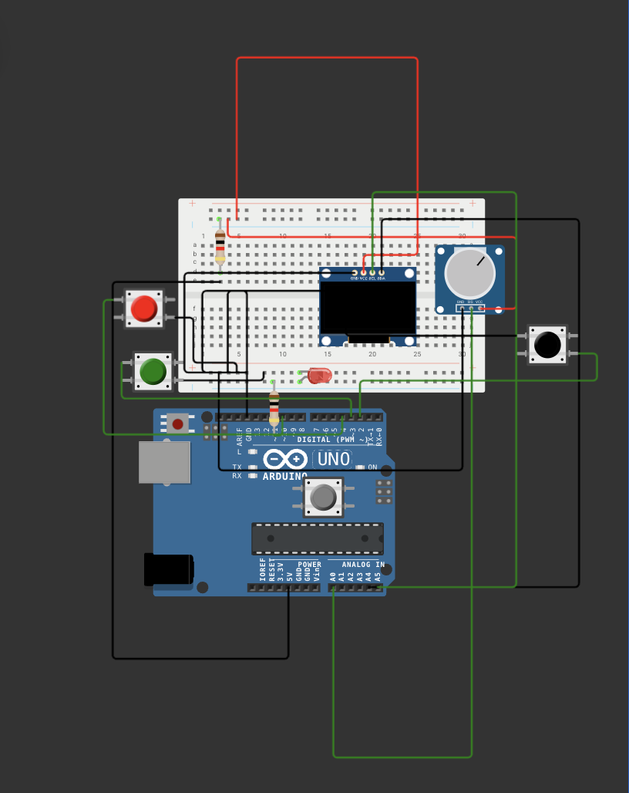
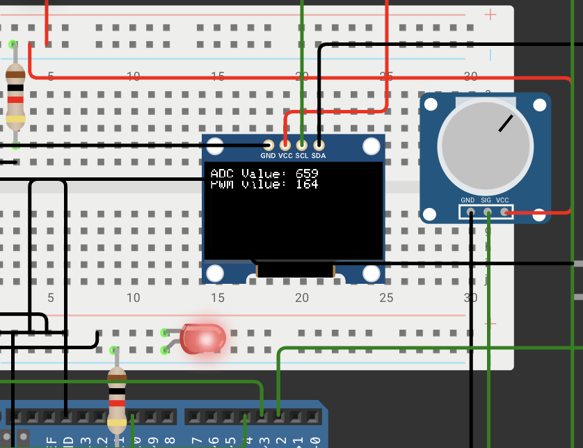
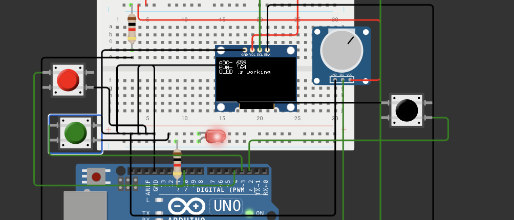
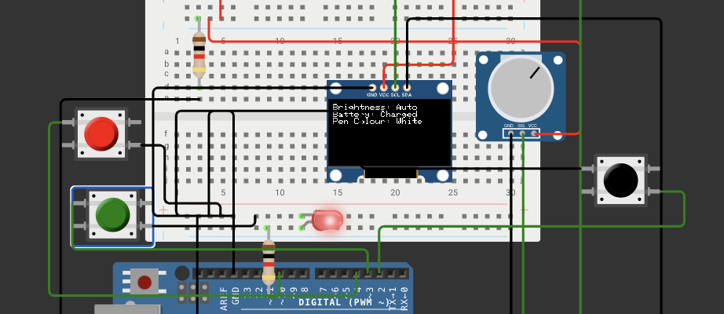
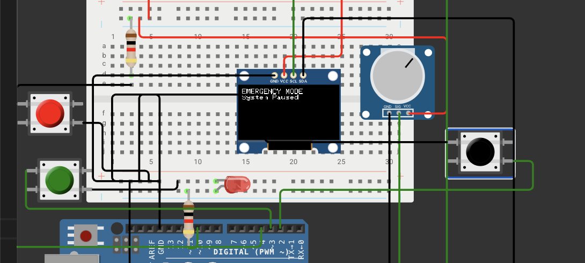

# Real-Time OLED Embedded Dashboard

## Overview
This project is developed for the Arduino Uno platform. It reads the analog voltage from a potentiometer using the ADC peripheral and generates a corresponding PWM signal to control the brightness of an LED. The ADC value and PWM output are displayed on an SSD1306 OLED display.

The dashboard consists of three OLED pages that can be navigated using dedicated Previous and Next buttons. In addition, the system includes an interrupt-driven emergency mode that temporarily pauses normal operation for two seconds before automatically resuming.

The project demonstrates several embedded systems concepts including ADC, PWM, UART debugging, I2C communication, interrupts, EEPROM storage, and non-blocking task scheduling.

---

## Features

* Analog input using a potentiometer (ADC)
* PWM control of LED brightness
* SSD1306 OLED dashboard using I2C communication
* Multiple OLED pages with button navigation
* UART debugging interface
* Interrupt-driven emergency button
* Software debouncing
* Non-blocking scheduler using millis()
* EEPROM page persistence
* Structured firmware using structs and enums

---

## Hardware Used

* Arduino Uno
* SSD1306 OLED Display (I2C)
* Potentiometer
* LED
* 3 Push Buttons
* Breadboard and jumper wires

---

## Pin Connections

| Arduino Pin | Function                     |
| ----------- | ---------------------------- |
| A0          | Potentiometer Input          |
| D10         | PWM LED Output               |
| D2          | Emergency Button (Interrupt) |
| D3          | Next Page Button             |
| D4          | Previous Page Button         |

---

## OLED Pages

### Home Page

Displays:

* ADC Value
* PWM Value

### UART Page

Displays:

* ADC Value
* PWM Value
* UART Status

### Status Page

Displays:

* Brightness Mode
* Battery Status
* Display Settings

### Emergency Screen

Activated through an external interrupt and pauses normal system operation for 2 seconds.

---

## Firmware Architecture

Scheduler

* ADC/PWM Task (20 ms)
* OLED Update Task (150 ms)
* UART Debug Task (500 ms)

User Interface

* Multi-page OLED navigation
* Finite State Machine based page control

Interrupts

* Emergency button using external interrupt
* Software debounce protection

Storage

* EEPROM used to save the last active page

---

## Embedded Concepts Demonstrated

* GPIO
* ADC
* PWM
* UART
* I2C
* Interrupts
* Debouncing
* Cooperative Scheduling
* Function Pointers
* Finite State Machines
* Structs
* Enums
* EEPROM Persistence

--
## Circuit Diagram

## Home Page

## UART Page

## Status Page

## Emergency Mode

--

## Author

Nandineesh Tripathi
